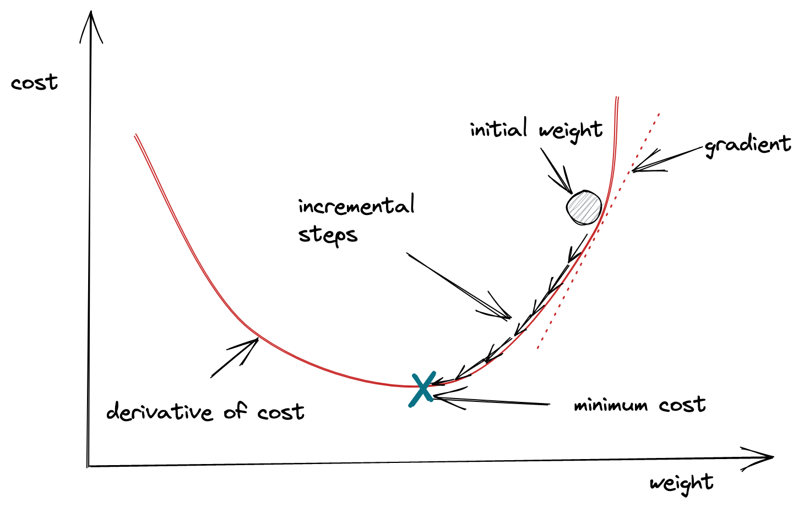
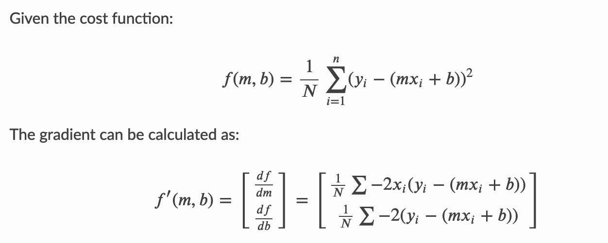
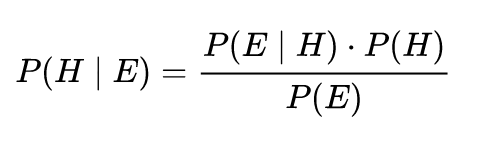

# Machine Learning Introduction Exercises

1. According to the paper [A Few Useful Things to Know about Machine Learning](https://homes.cs.washington.edu/~pedrod/papers/cacm12.pdf) by Pedro Domingos 

- What is the meaning of generalization?
> According to the paper, generalization is the goal of machine learning. 
It means to generalize beyond the examples in the training set using classifiers.
Therefore, how well the classifiers are chosen has a crucial impact on the machine learning algorithm.
The quality of classifiers can be improved by separating data for training and testing andcross-validation.

- What are the many faces of over-fitting?
> The faces of over-fitting, according to the paper, are `bias` and `variance`. 
Bias is a learner’s tendency to consistently learn the same wrong thing.
Variance is the tendency to learn random things irrespective of the real signal. 

- Why do humans have problems in higher dimensions?
> Because humans perceive the world as three-dimensional, and often do not understand high-dimensional objects, 
where almost all the volume of the object is outside or near the surface of itself and not inside. 

- What is feature engineering?
> Feature engineering is constructing features from the raw data that correlate well with the class
 and thus are amenable to learning. Good feature engineering do not only require techniques but also
intuition, creativity and "black art".

- Why does more data beat clever algorithms?
> Because machine learning is about letting data do the heavy lifting. The more data, the more complex classifiers can be learned

- What is ensemble learning?
> Ensemble learning is to combine different models in one system. There are three techniques of ensemble models: 
 **Bagging**: generate random variations of the training set by resampling, learn a classifier on each, and combine the results by
voting. This works because it greatly reduces variance while only slightly increasing bias. 
 **Boosting**: training examples have weights, and these are varied so that each new classifier focuses on the examples the previous
ones tended to get wrong. 
 **Stacking**: the outputs of individual classifiers become the inputs of a “higher-level”
learner that figures out how best to combine them.

 - What is accuracy in data science?
> According to the article, accuracy means that the hypotheses make the correct generalization and not that the hypotheses are simple.

2. Describe the core idea of gradient descent in a few paragraphs. Pictures, equations or anything you need is also fine. 
- Gradient descent is an optimization algorithm used to minimize some function by iteratively moving in the direction of 
the steepest descent as defined by the negative of the gradient. In machine learning, gradient descent is used to update model's parameters. 
Parameters refer to `coefficients` in Linear Regression and `weights` in neural networks.

- **Analogy**: a commonly used analogy to understand gradient descent is a person is stuck in the mountains and is trying to get down, 
i.e. trying to find the global minimum. Starting at the top of the mountain, we take our first step downhill in the direction 
specified by the negative gradient. Next we recalculate the negative gradient and take another step in the direction it specifies. 
We continue this process iteratively until we get to the bottom of our graph, or to a point where we can no longer move downhill–a local minimum.

- **Learning rate**: the size of each step. A high learning rate can create more progress, but also risk overshooting the lowest point 
since the slope is constantly changing. A low learning rate is more precise and secure, but calculating the gradient is time-consuming.
- **Loss/Coss function**: a Loss Function or a Coss Function represents “how good” the model is at making predictions for a given set of parameters. 
The cost function has its own curve and its own gradients. The slope of this curve gives insights on how to update our parameters to make the model more accurate.
- **Calculation example**:

[Image source](https://ml-cheatsheet.readthedocs.io/en/latest/gradient_descent.html#step-by-step)

3. Learn about Bayesian Statistics / Algorithm from this video [1] or find a better resource. Tell me what you learned including the best example you came over. 
- Bayesian statistics is a mathematical procedure that applies probabilities to statistical problems. 
It provides people the tools to update their beliefs in the evidence of new data.
- Probability of an event A given B equals the probability of B and A happening together divided by the probability of B.

- [Example from Analytics Vidhya](https://www.analyticsvidhya.com/blog/2016/06/bayesian-statistics-beginners-simple-english/#h2_7):
  - Out of all the 4 championship races (F1) between Niki Lauda and James Hunt, Niki won 3 times while James managed only 1.
  If we were to bet on the winner of next race, Niki Lauda seems to have a better chance (3/4 = 75%). 
  - However, there’s a twist. If we know it rained once when James won and once when Niki won, 
  and it is definitely going to rain on the next date, chances of winning for James now increase drastically.
  - Here is the explaination. Suppose, B is the event of winning of James Hunt. A is the event of raining. Therefore,
    - P(E) = 1/2, since it rained twice out of four days.
    - P(H) = 1/4, since James won only one race out of four.
    - P(E|H) = 1, since it rained every time when James won.
  Substituting the values in the conditional probability formula, we get the probability P(H|E) = P(E|H)*P(H)/P(E) = 2/4 = 50%, which is almost the double of 25% when rain was not taken into account 