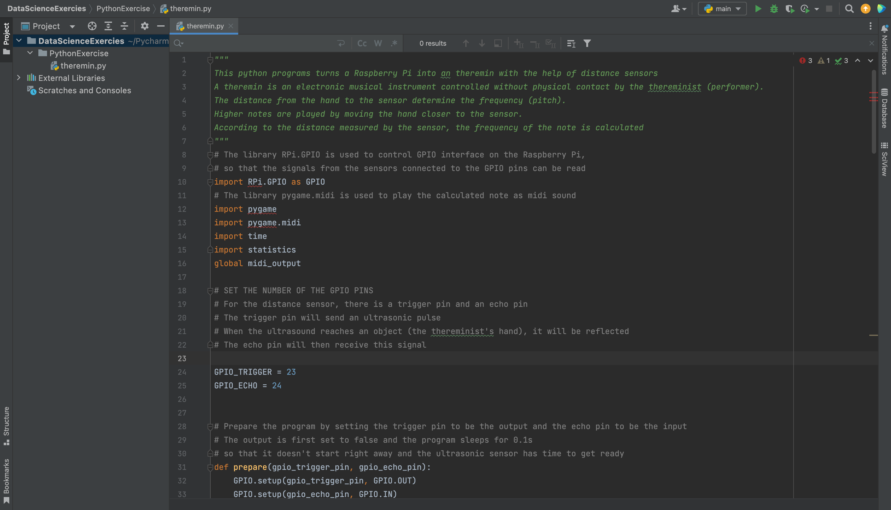

# Data Science (BHT MIM 20 S22)
## Python Exercise
> The idea is: DevEnvironment + your passion!

### IDE Setup
- Chosen IDE: [PyCharm](https://www.jetbrains.com/help/pycharm/2022.1/quick-start-guide.html) 
- Screenshot: 

### Python program
- I created a python script that can turn a [Raspberry Pi](https://www.raspberrypi.org/) into a [theremin](https://en.wikipedia.org/wiki/Theremin) using an [HC-SR04 Ultrasound Distance Sensor](https://www.sparkfun.com/products/15569)
- For more detailed explaination, please read the comment in the script: [theremin.py](theremin.py)

