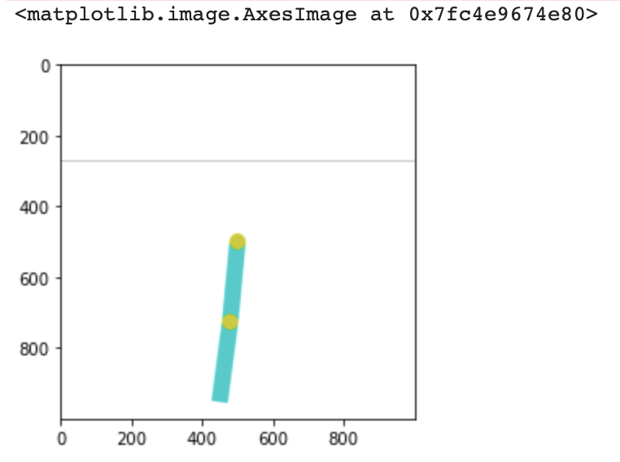

# Reinforcement Learning Exercise
Write a client for any environment from open.ai GYM.

## Create a "Acrobot-v1" client with random action
This is based on the tutorial [Getting Started With OpenAI Gym: The Basic Building Blocks](https://blog.paperspace.com/getting-started-with-openai-gym/) by Ayoosh Kathuria

### Create and observe the environment and 
```python
import gym

env = gym.make("Acrobot-v1")
# Observation and action space 
obs_space = env.observation_space
action_space = env.action_space
print("The observation space: {}".format(obs_space))
print("The action space: {}".format(action_space))
```
Output:
> The observation space: Box([ -1.        -1.        -1.        -1.       -12.566371 -28.274334], [ 1.        1.        1.        1.       12.566371 28.274334], (6,), float32)

> The action space: Discrete(3)

### Taking a random action
```python
import matplotlib.pyplot as plt 

# reset the environment and see the initial observation
obs = env.reset()
print("The initial observation is {}".format(obs))

# Sample a random action from the entire action space
random_action = env.action_space.sample()

# Take the action and get the new observation space
new_obs, reward, done, info = env.step(random_action)

```
Output:
> The initial observation is [ 0.99943817 -0.0335158   0.99944896  0.03319339 -0.01735185 -0.0614587 ]

> The new observation is [ 0.9998198  -0.0189821   0.99980867 -0.0195598   0.15789415 -0.45432547]

### Capturing the environment screen
```python
# Capture the environment screen
env_screen = env.render(mode = 'rgb_array')
env.close()

# Plot the screenshot
import matplotlib.pyplot as plt 
plt.imshow(env_screen)
```
Output:


### Training the agent with random action
```python
# Run the agent with random actions
import time 

# Number of steps to run the agent for 
num_steps = 1500

obs = env.reset()

for step in range(num_steps):
    # Take a random action
    action = env.action_space.sample()
    
    # Apply the action
    obs, reward, done, info = env.step(action)
    
    # Render the env
    env.render()

    # Wait a millisecond before the next frame
    time.sleep(0.001)
    
    if done:
        env.reset()

# Close the env
env.close()
```

Output:

