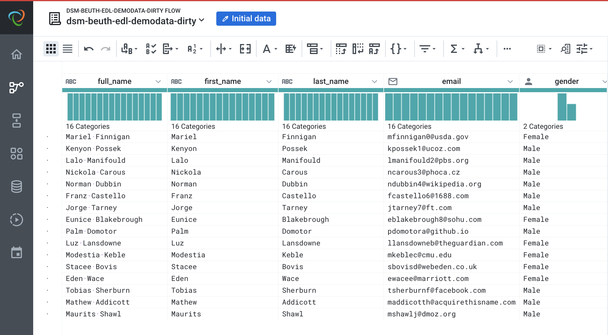

# Tool Supported Data Cleaning Exercise

## Exercise 1
> Clean the [dsm-beuth-edl-demodata-dirty.csv](https://raw.githubusercontent.com/edlich/eternalrepo/master/DS-WAHLFACH/dsm-beuth-edl-demodata-dirty.csv) with Trifacta Wrangler
### Cleaning recipe

### Result screenshot

## Exercise 2
> Load the [Grid_Disruption_00_14_standardized - Grid_Disruption_00_14_standardized.csv](https://www.kaggle.com/datasets/autunno/15-years-of-power-outages?select=Grid_Disruption_00_14_standardized+-+Grid_Disruption_00_14_standardized.csv) Dataset from Kaggle: 15 YEARS OF POWER OUTAGES. 
### The errors

### How to clean this file