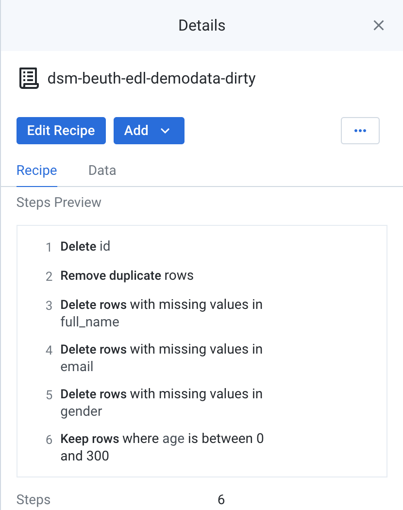

# Tool Supported Data Cleaning Exercise

## Exercise 1
> Clean the [dsm-beuth-edl-demodata-dirty.csv](https://raw.githubusercontent.com/edlich/eternalrepo/master/DS-WAHLFACH/dsm-beuth-edl-demodata-dirty.csv) with Trifacta Wrangler
### Cleaning recipe

### Result screenshot


## Exercise 2
> Load the [Grid_Disruption_00_14_standardized - Grid_Disruption_00_14_standardized.csv](https://www.kaggle.com/datasets/autunno/15-years-of-power-outages?select=Grid_Disruption_00_14_standardized+-+Grid_Disruption_00_14_standardized.csv) Dataset from Kaggle: 15 YEARS OF POWER OUTAGES. 
### The errors

- `Time Event Began` and `Time of Restoration` have invalid datetime values such as "Midnight", "Ongoing", "Evening", "NA"...
- `Time Event Began` and `Time of Restoration` have different datetime format ("a.m." and "AM")
- `Date of Restoration` has invalid date values such as "NA", "Ongoing", "Unknown"
### How to clean this file


#### Recipe
```
replacepatterns col: {Time Event Began},{Time of Restoration} with: '.' on: '. ' global: true
replacepatterns col: {Time Event Began},{Time of Restoration} with: '.' on: '..' global: true
replacepatterns col: {Time Event Began},{Time of Restoration} with: ' ' on: '  ' global: true
replacepatterns col: {Time Event Began},{Time of Restoration} with: ' :' on: ': ' global: true
replacepatterns col: {Time Event Began},{Time of Restoration} with: ':' on: ' :' global: true
replacepatterns col: {Time Event Began},{Time of Restoration} with: 'AM' on: 'a.m.' global: true
replacepatterns col: {Time Event Began},{Time of Restoration} with: 'AM' on: 'a.m' global: true
replacepatterns col: {Time Event Began},{Time of Restoration} with: ' AM' on: 'a.' global: true
replacepatterns col: {Time Event Began},{Time of Restoration} with: 'PM' on: 'p.m.' global: true
replacepatterns col: {Time Event Began},{Time of Restoration} with: '12:00 AM' on: 'Midnight' global: true
replacepatterns col: {Time Event Began},{Time of Restoration} with: '6:00 PM' on: 'Evening' global: true
replacepatterns col: {Time Event Began},{Time of Restoration} with: '12:00 PM' on: '12 noon' global: true
replacepatterns col: {Time Event Began},{Time of Restoration} with: '12:00 PM' on: '12:00 noon' global: true
replacepatterns col: {Time Event Began},{Time of Restoration} with: '12:00 AM' on: '12 AM' global: true
replacepatterns col: {Time Event Began},{Time of Restoration} with: '2:00 PM' on: '14:00' global: true
replacepatterns col: {Time Event Began},{Time of Restoration} with: ':02 PM' on: ':2:00 PM PM' global: true
replacepatterns col: {Time Event Began},{Time of Restoration} with: '' on: `:{SS}` global: true start: `{a}:{MM}`
filter type: custom rowType: single row: ISMISMATCHED({Time Event Began}, ['Datetime','hh:mm:ss','hh:MMa']) action: Delete
filter type: exactly col: {Time of Restoration} exactly: 'N\/A' action: Delete
filter type: custom rowType: single row: ISMISMATCHED({Date of Restoration}, ['Datetime','mm-dd-yy','mm*dd*yyyy']) action: Delete
filter type: custom rowType: single row: ISMISSING([{Time of Restoration}]) action: Delete
filter type: custom rowType: single row: ISMISSING([{Time of Restoration}]) action: Delete
```